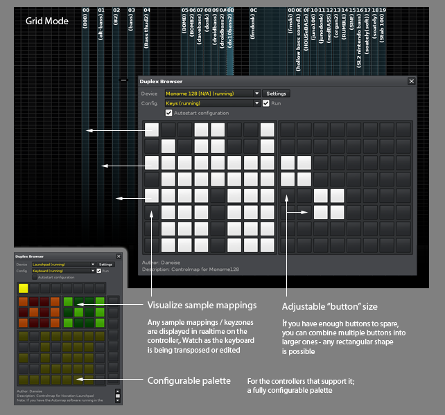
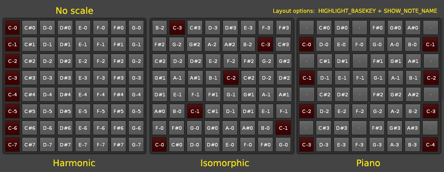

# Duplex.Applications.Keyboard

## About

The Duplex Keyboard is a flexible keyboard replacement for Renoise. It offers the following extra features

* Supports pad/grid controllers and OSC devices
* In grid mode, offers customizable layouts (harmonic, isomorphic, etc.)
* Able to remap received mod-wheel/pitch bend message to CC messages (record as automation)
* Can interpret an(y) incoming message as mod-wheel/pitch-bend
* Does split-keyboard layouts, routing to instruments and tracks. 

## Prerequisites

The Keyboard application will not work unless you have enabled the internal OSC server in Renoise (Renoise prefereces -> OSC settings). It should be set to "UPD" protocol, and use the same port as specified in Duplex/Globals.lua (by default, this is set to the same value as Renoise, "8000").

## How it works 

The Keyboard application can be used as a standard keyboard (visulized as black & white keys in the virtual control surface), or as individually-mapped keys/pads, suitable for grid and pad controllers.

**Keyboard Mode**  
When you are using the application in the standard keyboard mode, it might receive pitch bend and channel pressure information from the device, which can then be A) ignored, B) broadcast as MIDI (unchanged), C) or routed internally to any MIDI CC message (this in turn means that you can easily use the native MIDI mapping in Renoise to map the pitch bend to any parameter) 

Furthermore, since we are using internally-triggered notes we have the ability to trigger notes inside a specific track, using a specific instrument. The default setting is identical to the standard behavior in Renoise, and will simply use the currently selected track/instrument. But it's possible to select any track or instrument by specifying it in the options.
 
Note that you can stack multiple Keyboard applications to control/trigger multiple instruments with a single master keyboard. The "MIDI-Keyboard" device comes with a configuration that demonstrate this ("Stacked Keys"), in which three instrument are triggered, each with different settings.

**Grid Mode**  
In grid mode, the Keyboard application is able to visualize the currently selected instrument's keyzone/sample mappings in realtime. This makes it a lot easier to see exactly where each sound is located, and even works as you are moving mappings around, or transposing the keyboard (octave up/down). 

Also, all of the UISlider mappings (volume, octave, pitch bend, etc.) support grid mode, as their mappings can be mapped to buttons just as easily as they can be mapped to a physical slider or fader. 

Furthermore, the grid mode supports a number of different layouts. Each one has it's own character,
and will invite to different playing styles: 
 
**Harmonic**: choose this layout if you are playing an instrument within a specific harmonic scale.
Left and right are the keys within the scale, up and down will move through octaves.
 
**Isomorphic**: this layout is nice if you want to reach all notes (not restricted to a harmonic scale).
Specific finger patterns will result in specific chords, no matter where you press. 
 
**Piano**: this is a "piano style" layout, useful if you are used to playing a traditional piano but otherwise
not really advisable (it takes up a lot of space to have separate rows of black and white keys). 
 
**Harmonic scales and keys**  
Here is an image that show how each layout will respond to a harmonic scale.
See how the harmonic layout is the only one without redundant pitches...?

In this image, we are setting the scale key to every possible value.

Setting the scale key does not simply transpose the notes - it pushes the scale upwards by the
selected number of semitones. As a result, the trigger pad/button might be assigned to a different
pitch (generally speaking, you do not want to apply a harmonic scale to the isomorphic layout.
It only seemed like a good idea for this screenshot, as it clearly demonstrates what is happening). 

**Additional Features**

* Voice-manager: the foundation for some of the more advanced features, basically it keeps track of
the currently playing notes, their designated instrument and track + it eliminates the potential problem
of stuck notes when you're changing octave from within Renoise while pressing one or more keys...
* Upper and lower range, to create a split keyboard (so you don't have to edit your instrument to achieve this)

## Links

Tool discussion is located on the [Renoise forum](http://forum.renoise.com/index.php?/topic/33806-new-tool-duplex-keyboard/)

## Available mappings 

| Name       | Description   |
| -----------|---------------|
| `keys` | Keyboard: trigger notes using keyboard |
| `key_grid` | Keyboard: trigger notes using buttons or pads |
| `pitch_bend` | Keyboard: pitch-bend wheel |
| `mod_wheel` | Keyboard: mod wheel |
| `pressure` | Keyboard: channel pressure |
| `volume` | Keyboard: volume control |
| `volume_sync` | Keyboard: sync volume with Renoise |
| `octave_down` | Keyboard: transpose keyboard down |
| `octave_up` | Keyboard: transpose keyboard up |
| `octave_set` | Keyboard: set active keyboard octave |
| `octave_sync` | Keyboard: sync octave with Renoise |
| `track_set` | Keyboard: set active keyboard track |
| `track_sync` | Keyboard: sync track with Renoise |
| `instr_set` | Keyboard: set active keyboard instrument |
| `instr_sync` | Keyboard: sync instrument with Renoise |
| `cycle_layout` | Keyboard: cycle between available layouts |
| `all_notes_off` | Keyboard: stop all playing notes |

## Available options

| Name       | Description   |
| -----------|---------------|
| `instr_index` | Choose which instrument to control |
| `track_index` | Choose which track to use  |
| `velocity_mode` | Determine how to act on velocity range (the range specified in the control-map)  |
| `keyboard_mode` | Determine how notes should be triggered  |
| `base_volume` | Determine how to control keyboard volume  |
| `channel_pressure` | Determine how to treat incoming channel pressure |
| `pitch_bend` | Determine how to treat incoming pitch bend messages |
| `mod_wheel` | Determine how to treat incoming mod wheel messages |
| `release_type` | Determine how to respond when the same key is triggered multiple times |
| `button_width` | Specify the button width (when in grid mode) |
| `button_height` | Specify the button height (when in grid mode) |
| `base_octave` | Specify the default starting octave |
| `upper_note` | Specify a note as upper boundary |
| `lower_note` | Specify a note as lower boundary |
| `grid_layout` | Specify a keyboard layout for the grid |

## Changelog

0.99.4
- Support for Renoise 3 trigger options (hold/mono modes)
- Custom grid layouts (harmonic, isomorphic layout and piano emulation)

0.99.2
- Adapted to UIKey changes 
- New mapping: mod_wheel

0.98.32
- TWEAK: velocity now is set to an explicit value, or synced to Renoise keyboard 
  velocity will output a fixed velocity (previously it was relative to messages)

0.98.16
- Display message on how to enable OSC server (first time only)

0.98.15
- New option: “Keyboard Mode”, choose which notes (if any) to trigger

0.98 
- First release 