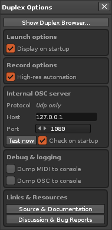

# Getting Started

## The front-end 

For the most part, the Duplex front-end is designed to be self-documenting - mouse over any part of the interface to get help and additional information about what each buttons/control does. The following is a quick walk-through of the most important user-interface elements, and how they work:

### The tool menu
When Duplex is first installed, a sub-menu labelled Duplex will appear in the tools menu

  
*The tool menu provides instant access to device configurations*

| Name          | Description   |
| ------------- |---------------|
|Show browser|Display the Duplex browser, the primary UI for displaying and navigating devices
|Release all open devices| Close all running devices & configurations that are currently running
|Display on startup| Enable this to show the Duplex browser on startup. This will only have an effect when one or more device configurations have been selected to “autostart”
|High-res automation| Enable high-res automation recording for all applications that implement [Automateable](Applications/Automateable.md)
|Dump MIDI to console| This is useful for debugging MIDI devices
|Dump OSC to console| This is useful for debugging OSC devices
|Documentation| Show the online documentation

Furthermore, the menu provides quick access to all of Duplex’ presets (a.k.a. device configurations). Each one comes with a descriptive name such as "Launchpad Mixer + Matrix", or "Simple TouchOSC template", categorized by the device name. Each of these configurations represent a mix of application that we have found to be useful, sometimes selected by popular vote. Select any one of them, and the Duplex Browser dialog will appear.

### The browser

From the Duplex browser, you can turn device configurations on/off, and switch between any device & it’s configurations. The window also contain a unique feature in Duplex, the virtual representation of the hardware using native Renoise UI components (a.k.a. the virtual control surface).  

Note that the browser is a fully multi-tasking environment - each device configuration can define multiple applications, and multiple devices can be opened simultaneously. When a device is presently active and running, it will contain an additional “(running)” suffix appended to it’s name. 

  
*The Duplex browser running a TouchOSC configuration*

| Name          | Description   |
| ------------- |---------------|
|Run| Specify if the application is presently active / responding to input
|Autostart| Make the selected application start when Renoise is first launched
|Options| Bring up the device-config options

### The options dialog

With each device configuration you have an options dialog, which contain the device settings, as well as application-specific options. Note that these settings (including the device settings) are unique per device configuration, so you can have the Mixer application configured differently in two applications. The options are persistent (remembered between sessions) and applied in real-time, so any change you make should immediately be reflected on the device. 

  
*The Duplex options dialog*

#

> < Previous - [Installation](Installation.md) &nbsp; &nbsp; | &nbsp; &nbsp; Next - [Bundled Applications](Applications.md) >